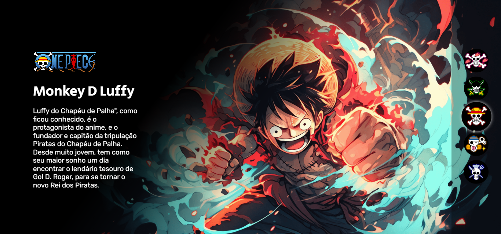

# Projeto One Piece 2

Esse é o segundo projeto de Front-end com base nas aulas gratuitas do Dev Em Dobro. O projeto é constitído de 5 personagens da tripulação do Chapéu de Palha, sendo o Chopper, Zoro, Luffy, Nami e o Sanji, aparecendo na tela quando clicado no botão com a caveira representando cada um.

## Índice

- [Overview](#overview)
  - [Print do Projeto](#print-do-projeto)
  - [Links](#links)
- [Meu processo](#meu-processo)
  - [Construído com](#construído-com)
  - [O que aprendi](#o-que-aprendi)
  - [Códigos Utilizados](#codigos-utilizados)
- [Autor](#autor)
- [Agradecimento](#agradecimento)

## Overview

### Print do projeto



### Links

- URL da solução: [Repositório](https://github.com/maiarasteffen/onePiece2)

## Meu Processo

### Construído com

- Marcação HTML5 semântica
- Propriedades personalizadas do CSS
- Flexbox
- Grade CSS
- Google Fonts
- Javascript


### O que aprendi

Aprendi a utilizar funções no javascript de maneira mais reduzida e com funcionalidades que são faceis de entender até mesmo para iniciantes. Além de melhor a parte de estilos, com requisições mais claras e sendo apenas o necessário para aparecer na homepage.

### Códigos utilizados:

```html
<body>
    <main class="personagens">
      <div class="personagem">
        
        <div class="conteudo">
          <i class="logo"></i>
          <h2 class="nome-personagem">Tony Chopper</h2>
          <p class="descricao">
            Esta pequena rena ganhou a habilidade de mudar sua forma e de pensar como humanos após comer a fruta Hito Hito no Mi. Chopper é um valioso membro da tripulação dos Piratas do Chapéu de Palha, atuando como médico da tripulação.
          </p>
        </div>
      </div>
      <div class="personagem">
        
        <div class="conteudo">
          <i class="logo"></i>
          <h2 class="nome-personagem">Roronoa Zoro</h2>
          <p class="descricao">
            Primeiro pirata (segundo membro se contarmos com Luffy) a se juntar à tripulação de Piratas do Chapéu de Palha, Zoro aceitou o convite de Luffy após o capitão salvar sua vida.
          </p>
        </div>
      </div>
      <div class="personagem selecionado">
        
        <div class="conteudo">
          <i class="logo"></i>
          <h2 class="nome-personagem">Monkey D Luffy</h2>
          <p class="descricao">
            Luffy do Chapéu de Palha", como ficou conhecido, é o protagonista do anime, e o fundador e capitão da tripulação Piratas do Chapéu de Palha. Desde muito jovem, tem como seu maior sonho um dia encontrar o lendário tesouro de Gol D. Roger, para se tornar o novo Rei dos Piratas.
          </p>
        </div>
      </div>
      <div class="personagem">
        
        <div class="conteudo">
          <i class="logo"></i>
          <h2 class="nome-personagem">Nami</h2>
          <p class="descricao">
            Uma órfã de guerra, ainda criança Nami foi adotada por Bell-mère, uma mulher da Marinha. Enquanto crescia ao lado de sua irmã adotiva Nojiko, Nami já demonstrava sua paixão por desenhar mapas, sonhando em um dia fazer o mapa de todo o mundo.
          </p>
        </div>
      </div>
      <div class="personagem">
        
        <div class="conteudo">
          <i class="logo"></i>
          <h2 class="nome-personagem">Sanji</h2>
          <p class="descricao">
            Também conhecido como "Perna Negra" Sanji, este pirata foi o quinto a integrar a tripulação de Luffy. Suas ações como pirata lhe renderam a terceira maior recompensa entre os membros do Chapéu de Palha, além de atuar como cozinheiro oficial do grupo.
          </p>
        </div>
      </div>
    </main>
    <ul class="botoes">
      <li>
        <button class="botao">
          
        </button>
      </li>
      <li>
        <button class="botao">
          
        </button>
      </li>
      <li>
        <button class="botao selecionado">
          
        </button>
      </li>
      <li>
        <button class="botao">
          
        </button>
      </li>
      <li>
        <button class="botao">
          
        </button>
      </li>
    </ul>

    <script src="./src/js/script.js"></script>
  </body>
```
```css estilo
body {
    background-color: #000;
    overflow: hidden;
}

main::after {
    content: "";
    position: fixed;
    top: 0;
    left: 0;
    min-height: 100vh;
    width: 80vw;
    background: linear-gradient(-233deg, #000 40%, rgba(0, 0, 0, 0) 65%) no-repeat;
}

main .personagem {
    display: none;
    height: 100vh;
}

main .personagem.selecionado {
    display: block;
}

main .personagem .imagem{
    width: 100%;
    height: 100%;
    object-fit: cover; /* ajeitar a imagem para não ficar distorcida*/
}

.conteudo {
    position: absolute;
    top: 0;
    left: 120px;
    display: flex;
    flex-direction: column;
    justify-content: center;
    min-height: 100vh;
    max-width: 380px;
    z-index: 1;
}

.conteudo .nome-personagem {
    color: #fff;
    font-size: 50px;
    font-family: "Secular One";
    font-weight: 400;
    margin-bottom: 20px;
}

.conteudo .descricao {
    color: #fff;
    font-family: "Rubik";
    font-size: 25px;
    line-height: 30px;
}

.conteudo .logo {
    background-image: url("../img/one-piece-logo.png");
    background-size: cover;
    width: 230px;
    height: 100px;
    margin-bottom: 35px;
}

.botoes {
    position: fixed;
    top: 0;
    right: 0;
    display: flex;
    flex-direction: column;
    min-height: 100vh;
    width: 180px;
    justify-content: center;
    align-items: center;
    gap: 10px;
    background-color: rgba(0, 0, 0, 0.3);
}

.botoes .botao {
    border: none;
    background: none;
    cursor: pointer;
    border-radius: 50%;
}

.botoes .botao img {
    border-radius: 50%;
}


.botoes .botao.selecionado {
    transform: scale(1.2);
    box-shadow:  0 0 10px #d9d9d9;
}
```
``` css responsivo
@media (max-width:769px) {
    main::after {
        background: linear-gradient(0deg, #000 20%, rgba(0, 0, 0, 0.00) 65%) no-repeat;
        width: 100vw;
    }

    main .personagem .imagem {
        height: 85%;
    }

    .conteudo {
        justify-content: flex-end;
        left: 0;
        top: -20%;
        max-width: 100vw;
        padding: 30px;
    }

    .conteudo .nome-personagem {
        font-size: 36px;
    }

    .conteudo .descricao {
        max-width: 500px;
        font-size: 20px;
        line-height: 24px;
    }

    .botoes {
        flex-direction: row;
        align-items: flex-end;
        width: 100%;
        padding: 30px;
    }

    .botoes .botao img {
        max-width: 50px;
    }
}

@media (max-width:425px) {
    main .personagem .imagem {
        height: auto;
    }

    .conteudo .logo {
        width: 170px;
        height: 75px;
    }

    .conteudo {
        top: -30%;
    }

    .conteudo .nome-personagem {
        font-size: 24px;
    }

    .botoes {
        padding: 20px;
        top: -20%;
    }

    .botoes .botao {
        max-width: 50px;
    }
}
```
``` JS
const botoes = document.querySelectorAll(".botao");
const personagens = document.querySelectorAll(".personagem");


botoes.forEach((botao, indice) => {
    botao.addEventListener("click", () => {

        desselecionarBotao();
        desselecionarPersonagem();

        botao.classList.add("selecionado");
        personagens[indice].classList.add("selecionado");
    });
});

function desselecionarPersonagem() {
    const personagemSelecionado = document.querySelector(".selecionado");
    personagemSelecionado.classList.remove("selecionado");
}

function desselecionarBotao() {
    const botaoSelecionado = document.querySelector(".botao.selecionado");
    botaoSelecionado.classList.remove("selecionado");
}
```

## Autor

- GitHub - [@maiarasteffen](https://github.com/maiarasteffen)
- LinkedIn - [@maiarasteffen](https://www.linkedin.com/in/maiara-steffen/)
- Instagram - [@maiara_steffen](https://www.instagram.com/maiara_steffen/)


## Agradecimento

Quero agradecer muito ao [Dev em dobro](https://www.instagram.com/devemdobro/) que me ajudou em suas lives a me mostrar a forma mais simplificada e funcional para codar.